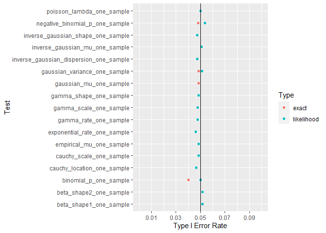
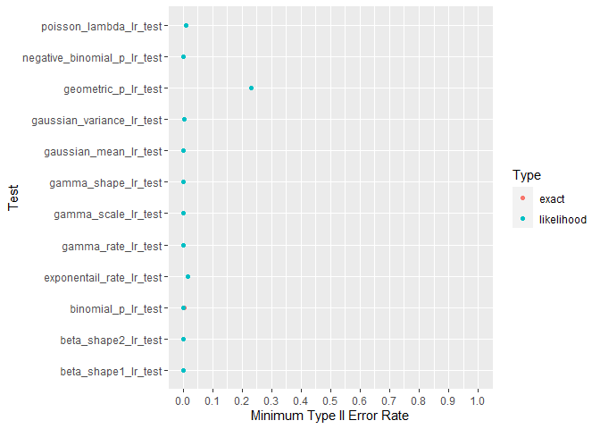

<!-- README.md is generated from README.Rmd. Please edit that file -->

# Repo Overview

This repo estimates asymptotic type I and type II error rates for
likelihood tests in MLTesteR. Detailed analysis can be found in the type
I and type II folders.

## Summary of Type I Error Rate

Most tests have a type I error rate of .05. Likelihood ratio tests match
exact tests.

## Summary of Type II Error Rate

Most tests can achieve near 0% type II error for a large enough effect
size. The test for a geometric distribution’s p test does not.

