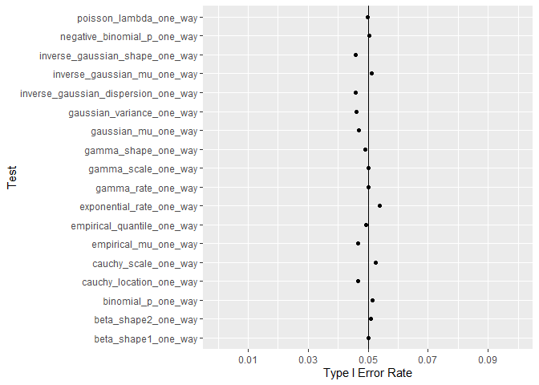
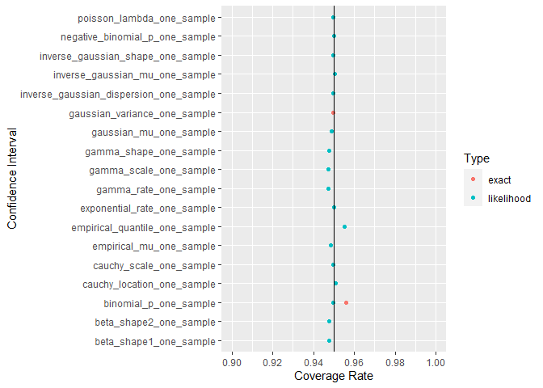

# Repo Overview

This repo is a simulation study. Each row is an experiment. It is
simulated in that data are generated from random generators. The first
five rows look like

    #> # A tibble: 180,000 x 8
    #>   test                      mu variance      stat pvalue alt       CI_LB CI_UB
    #>   <chr>                  <dbl>    <dbl>     <dbl>  <dbl> <chr>     <dbl> <dbl>
    #> 1 gaussian_mu_one_sample    -4        1 0.294      0.588 two.sided -4.09 -3.84
    #> 2 gaussian_mu_one_sample    -4        1 0.0000959  0.992 two.sided -4.15 -3.85
    #> 3 gaussian_mu_one_sample    -4        1 0.0468     0.829 two.sided -4.12 -3.85
    #> 4 gaussian_mu_one_sample    -4        1 0.0224     0.881 two.sided -4.12 -3.86
    #> 5 gaussian_mu_one_sample    -4        1 0.118      0.732 two.sided -4.11 -3.84
    #> # ... with 179,995 more rows
    #> # i Use `print(n = ...)` to see more rows

For each simulated experiment, both the true hypothesis and the outcome
of the test are known. Multiple experiments are aggregated to calculate
type I error rates.

    #> # A tibble: 30 x 4
    #> # Groups:   test, mu [10]
    #>   test                      mu variance Type_I_Error
    #>   <chr>                  <dbl>    <dbl>        <dbl>
    #> 1 gaussian_mu_one_sample    -4        1         0.05
    #> 2 gaussian_mu_one_sample    -4        3         0.05
    #> 3 gaussian_mu_one_sample    -4        5         0.05
    #> 4 gaussian_mu_one_sample    -2        1         0.05
    #> 5 gaussian_mu_one_sample    -2        3         0.05
    #> # ... with 25 more rows
    #> # i Use `print(n = ...)` to see more rows

Each simulated experiment is based on a sample size of 200. Each
combination of true hypothesis, parameter value, and test are repeated
2,000 times.

Detailed statistical analysis can be found in the type I and type II
folders. Code to run the simulation is in the R Code folder.

# One Sample Type I Error Rate

Most tests have a type I error rate of .05. Likelihood ratio tests have
similar error rates to exact tests.

# One Way Type I Error Rate

Compared to the one sample tests, type I error rates have increased.

For the one sample tests, all 200 data points are associated with one
group. The one parameter is estimated using all 200 data points. For the
one way tests, there are two groups and therefore two parameters that
must be estimated. Each parameter is based on only 100 data points each.
The cost of less data per parameter is a type I error further from the
target 5%.

# One Sample Type II Error Rate

All tests can achieve near 0% type II error for a large enough effect
size.

# One Way Type II Error Rate

Similar to above, all tests can achieve near 0% type II error rate.

# Confidence Interval Coverage

In addition to error rates, confidence interval coverage rates are
estimated. Most functions have a coverage rate of 95%. The worst
performing confidence intervals are within one a percentage point.

