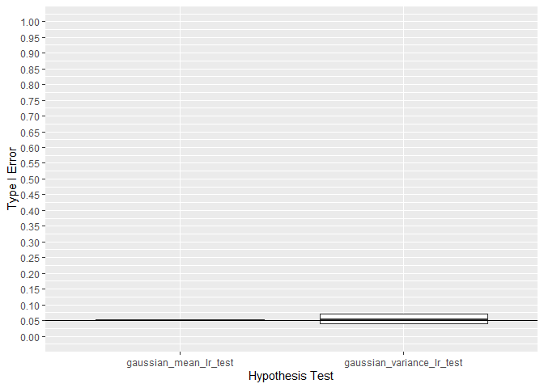

<!-- README.md is generated from README.Rmd. Please edit that file -->

## Summary

This repo is a performs a Type I and Type II simulation study on all
tests in the MLTesteR package.

    #> -- Attaching packages ------------------------------------------------------------------------------------------------------------------------------------------------ tidyverse 1.3.0 --
    #> v ggplot2 3.3.2     v purrr   0.3.4
    #> v tibble  3.0.3     v dplyr   1.0.0
    #> v tidyr   1.1.0     v stringr 1.4.0
    #> v readr   1.3.1     v forcats 0.5.0
    #> -- Conflicts --------------------------------------------------------------------------------------------------------------------------------------------------- tidyverse_conflicts() --
    #> x dplyr::filter() masks stats::filter()
    #> x dplyr::lag()    masks stats::lag()

## Gaussian

    #> `summarise()` regrouping output by 'test', 'alt', 'mu' (override with `.groups` argument)

Note that the `echo = FALSE` parameter was added to the code chunk to
prevent printing of the R code that generated the plot.
