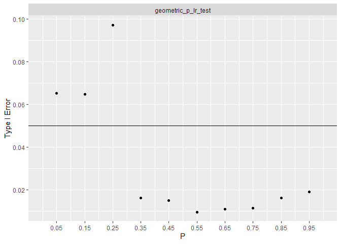

<!-- README.md is generated from README.Rmd. Please edit that file -->

# Summary

For a range of parameter values and all three alternative hypothesis,
type I error rates are estimated via simulation. The estimates are based
on 5,000 iterations and a sample size of 200. Where possible, exact
tests are included for comparison. At this sample size, most tests are
just above the .05 error rate.

 Exploring each
test one by one, most tests are consistent across the entire parameter
space and alternative hypotheses. The negative binomial and geometric
distributions are exceptions.

# Successful Distributions

For a distribution, the likelihood ratio test works well if

-   The test has an average of.05 type I error rate over the entire
    parameter space.
-   All tests achieve near .05 type I error for all alternative
    hypothesis.

To support both points, two graphs are shown. Where possible, exact
tests are included for comparison.

## Gaussian

## Gamma

## Poisson

## Beta

## Exponential

# Failures

For a distribution, the likelihood ratio test is considered bad if

-   The test does not achieve near .05 type I error rate over any area
    of the parameter space.
-   The test did not achieve near .05 type I error across all
    alternative hypothesis.

It is possible for a likelihood test to “fail” and still be good
approximation to the exact test. If the exact test does not meet the
conditions, the likelihood should not either.

## Negative Binomial

As long as the target number of success is large or p is not near one,
the type I error rate is .05. When the target number of successes is
small and p is near one, the likelihood test does not have a .05 type I
error rate. How near is too near depends on the target number of
successes. How small is to small depends on p. Visually this is the
bottom right corner of the graph.

The exact test has similar behavior in the bottom right but is always
conservative. The likelihood test can be either liberal or conservative.

In the aggregate, the likelihood test performs similarly to other
likelihood tests across alternative hypotheses.

## Geometric

In the above, type I error rates degraded as size decreased. The
geometric distribution is the same as the negative binomial with size
equal to 1. This suggests the geometric test will do poorly.

Over the entire range of p, both the exact test and the likelihood ratio
have type I error rate far from the desired .05. The exact test is
always conservative. Sometimes the likelihood test is liberal. Sometimes
it is conservative. Overall, the likelihood test has different type I
error rates than the exact test.

In the aggregate, type I error rates are below the desired .05. This is
due to the discrete nature of the test statistic.

