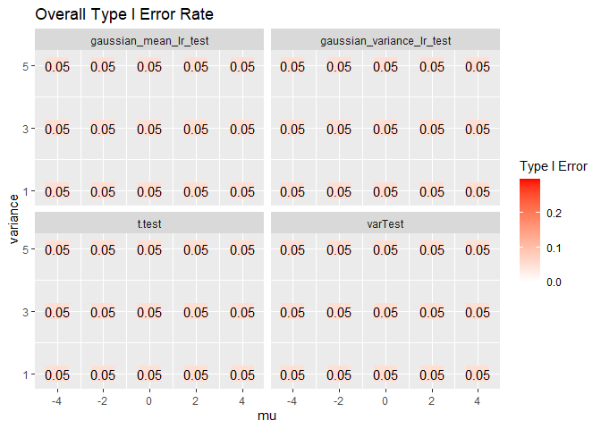
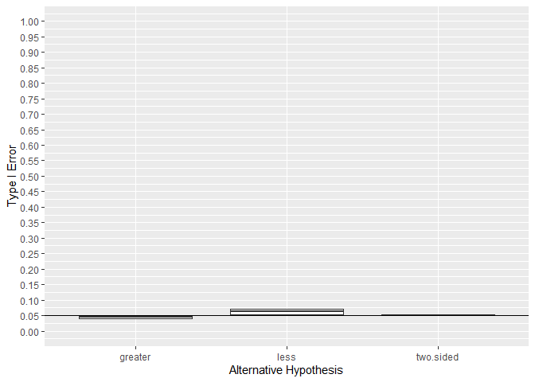
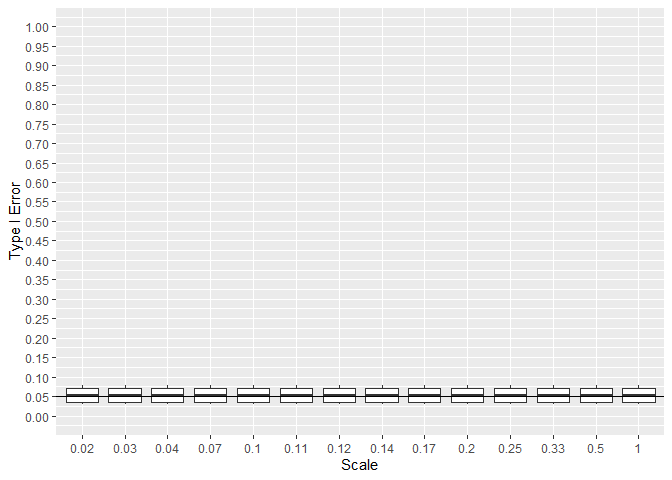
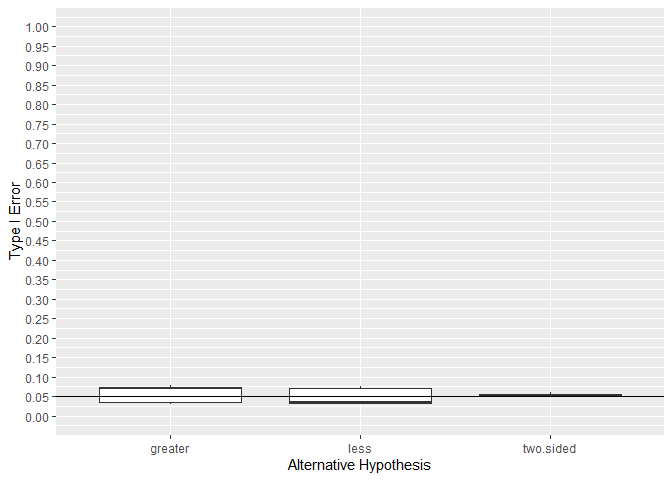
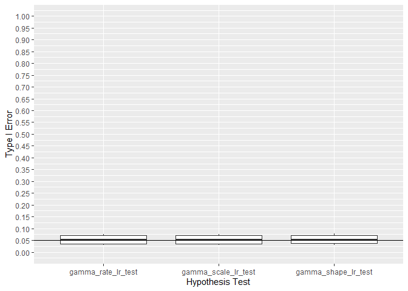
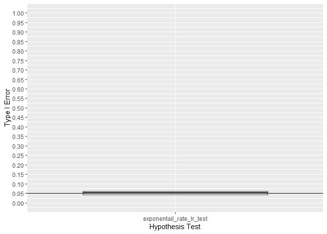

<!-- README.md is generated from README.Rmd. Please edit that file -->

## Summary

This repo is a performs a Type I and Type II simulation study on all
tests in the MLTesteR package.

    #> -- Attaching packages ------------------------------------------------------------------------------------------------------------------------------------------------ tidyverse 1.3.0 --
    #> v ggplot2 3.3.2     v purrr   0.3.4
    #> v tibble  3.0.3     v dplyr   1.0.0
    #> v tidyr   1.1.0     v stringr 1.4.0
    #> v readr   1.3.1     v forcats 0.5.0
    #> -- Conflicts --------------------------------------------------------------------------------------------------------------------------------------------------- tidyverse_conflicts() --
    #> x dplyr::filter() masks stats::filter()
    #> x dplyr::lag()    masks stats::lag()

## Gaussian

    #> `summarise()` regrouping output by 'test', 'alt', 'mu' (override with `.groups` argument)

## Gamma

    #> `summarise()` regrouping output by 'test', 'alt', 'shape', 'rate' (override with `.groups` argument)

## Poisson

    #> `summarise()` regrouping output by 'test', 'alt' (override with `.groups` argument)

## Beta

    #> `summarise()` regrouping output by 'test', 'alt', 'shape1' (override with `.groups` argument)

## Negative Binomial

    #> `summarise()` regrouping output by 'test', 'alt', 'p' (override with `.groups` argument)

    #> `summarise()` regrouping output by 'test', 'p' (override with `.groups` argument)

    #> `summarise()` regrouping output by 'test', 'alt', 'p' (override with `.groups` argument)

    #> `summarise()` regrouping output by 'test', 'p' (override with `.groups` argument)

    #> `summarise()` ungrouping output (override with `.groups` argument)
    #> # A tibble: 2 x 4
    #>   test                        minTypeI meanTypeI maxTypeI
    #>   <chr>                          <dbl>     <dbl>    <dbl>
    #> 1 exact                              0    0.0443   0.0542
    #> 2 negative_binomial_p_lr_test        0    0.0507   0.238

## Geometric

    #> `summarise()` regrouping output by 'test', 'alt' (override with `.groups` argument)

    #> `summarise()` regrouping output by 'test', 'alt' (override with `.groups` argument)

    #> [1] 0.0504

## Beta

    #> `summarise()` regrouping output by 'test', 'alt' (override with `.groups` argument)

