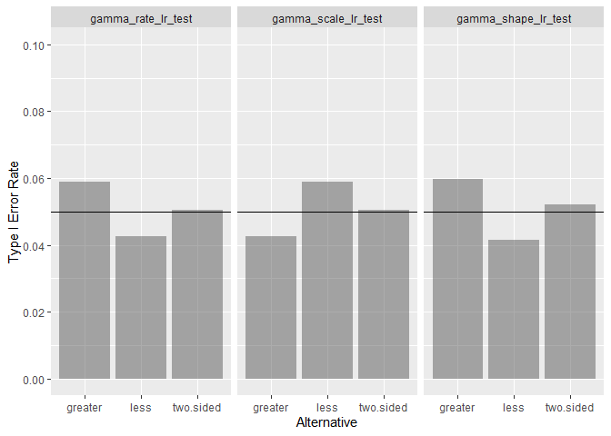
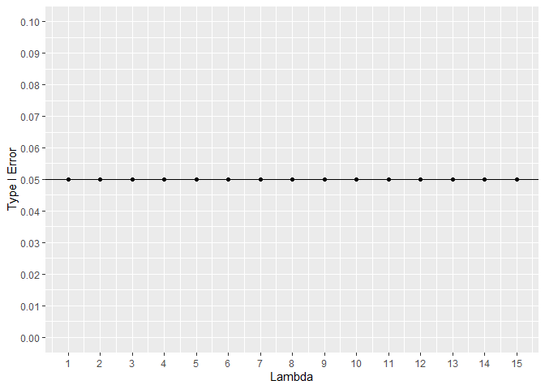
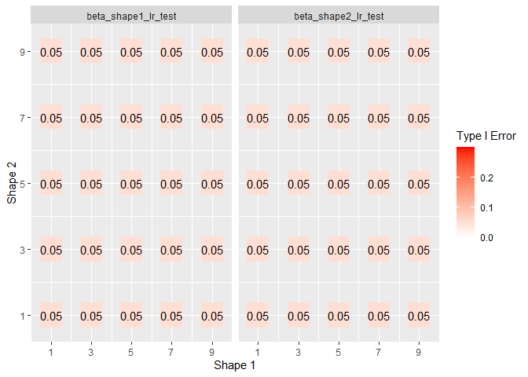
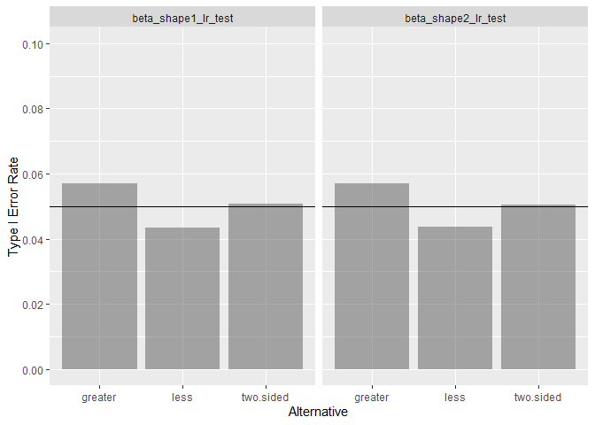
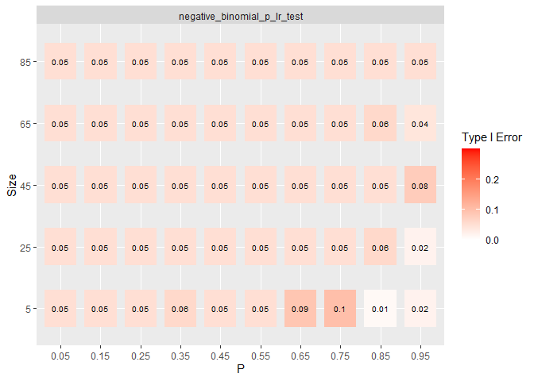
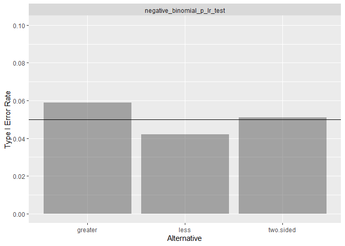

<!-- README.md is generated from README.Rmd. Please edit that file -->

# Summary

For a range of parameter values and all three alternative hypothesis,
type I error rates are estimated via simulation. The estimates are based
on 5,000 iterations and a sample size of 50. Where possible, exact tests
are included for comparison. At this sample size, most tests are just
above the .05 error rate.

 Exploring each
test one by one, most tests are consistent across the entire parameter
space and alternative hypotheses. The negative binomial has an area of
poor type I error rate. The geometric tests did poorly overall.

# Successful Distributions

For a distribution, the likelihood ratio test works well if

-   All tests achieve near .05 type I error rate over the entire
    parameter space.
-   All tests achieve near .05 type I error across all alternative
    hypothesis.

To support both points, two graphs are shown. Where possible, exact
tests are included for comparison.

## Gaussian

## Gamma

## Poisson

## Beta

## Exponential

# Failures

For a distribution, the likelihood ratio test is considered bad if

-   Any test did not achieve near .05 type I error rate over any area
    parameter space.
-   Any test did not achieve near .05 type I error across any
    alternative hypothesis.

It is possible for a test to “fail” and still be good approximation to
the exact test.

## Negative Binomial

For most parameter values, the negative binomial test performs well. For
values near 0 or 1, the test does not perform well for small number of
target successes. The exact test does well where the likelihood test
fails.

Both tests performed well in aggregate for all alternative hypothesis.

## Geometric

Over the entire range of p, both the exact test and the likelihood ratio
have type I error rate is near zero for some alternative hypothesis.
Given the exact test did nearly as bad, the likelihood test succeeded in
that is successfully approximated a bad exact test.

The test performed very poorly for the greater than alternative. Both
tests are extremely conservative.

