# Type I Summary

Asymptotic type I error rates for LRTesteR’s likelihood ratio tests are
estimated via simulation. Calculations are based on 5,000 iterations and
a sample size of 500. Where possible, exact tests are included for
comparison.

In aggregate, all tests have a 5% type I error rate at alpha set to 5%.

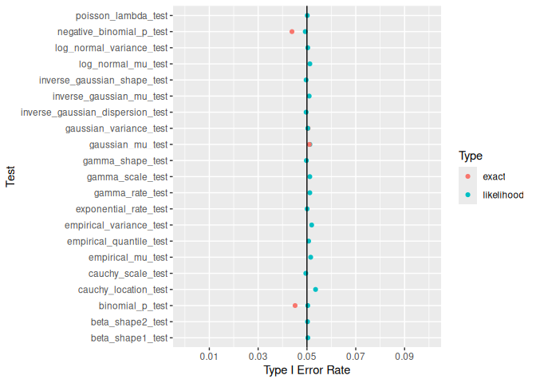

# Analysis Criteria

For a distribution, the likelihood ratio test works well if both of the
following are true.

- The test has an average of .05 type I error rate over the entire
  parameter space.
- All tests achieve near .05 type I error for all alternative
  hypotheses.

To check the above, two graphs are shown per test. For the first point,
type I error rate is calculated for many areas in the parameter
space.For the second point, results are aggregated across alternative
hypotheses.

The negative binomial distribution is the only distribution to fail the
first criteria and it only fails is a small region of the parameter
space where asymptotic theory’s requirements are not met.

## Gaussian

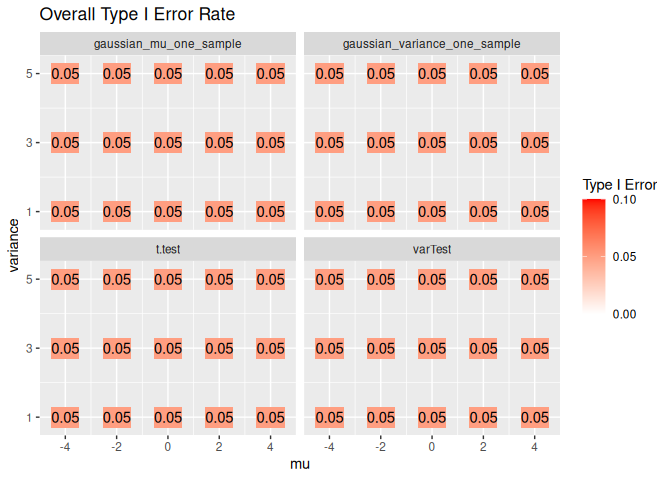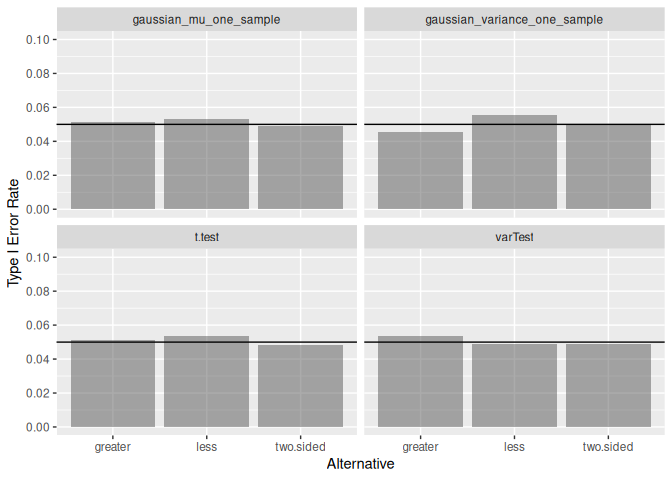

### Log Normal

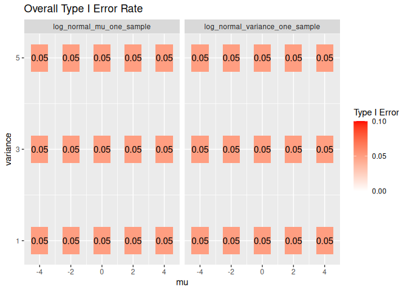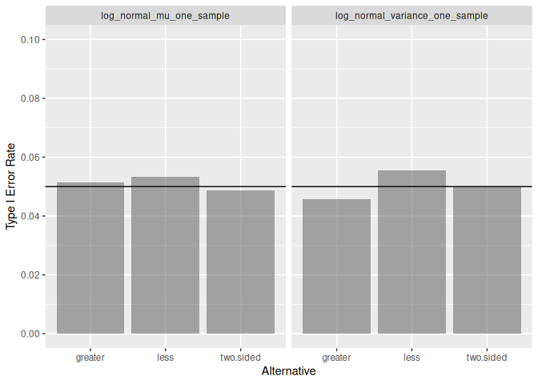

## Gamma

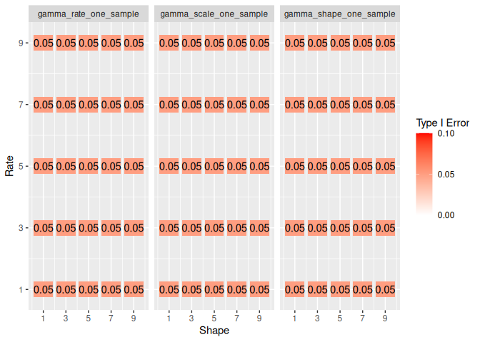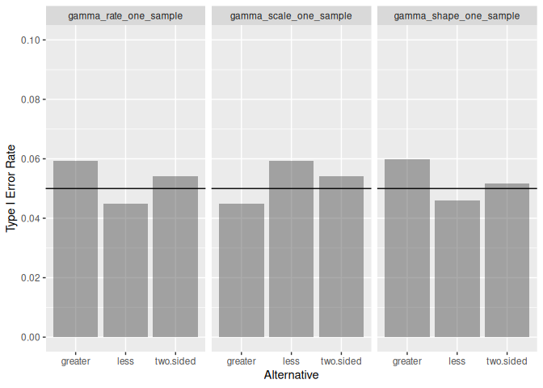

## Poisson

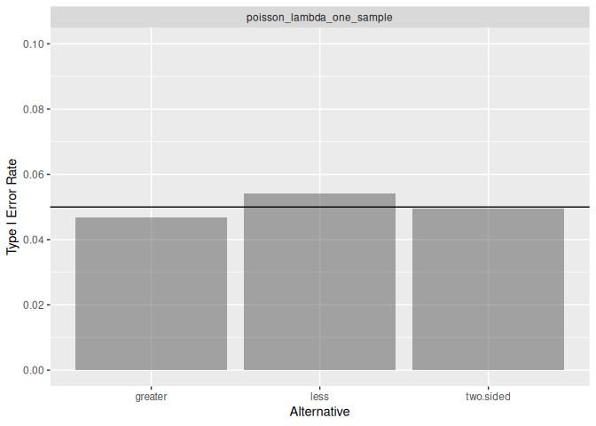

## Beta

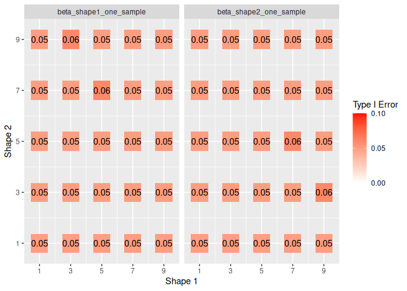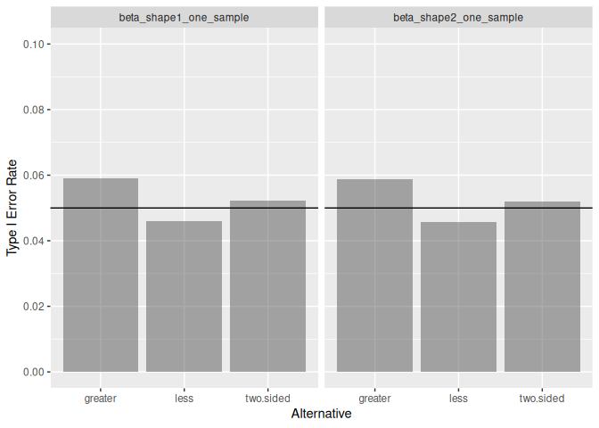

## Exponential

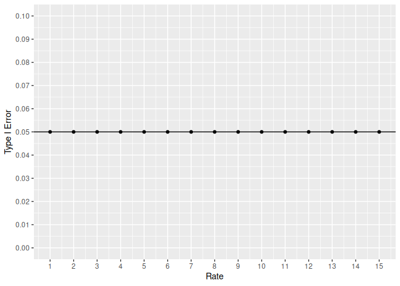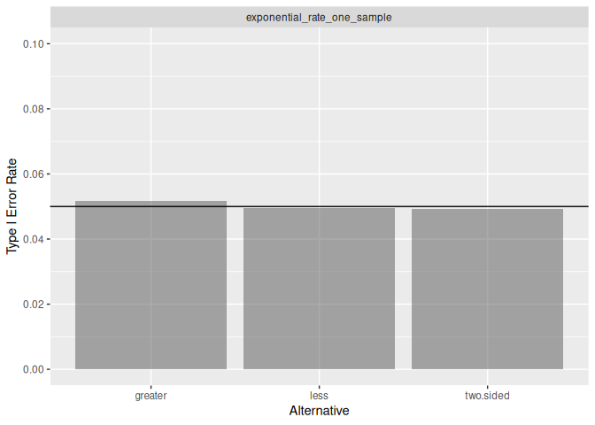

## Binomial

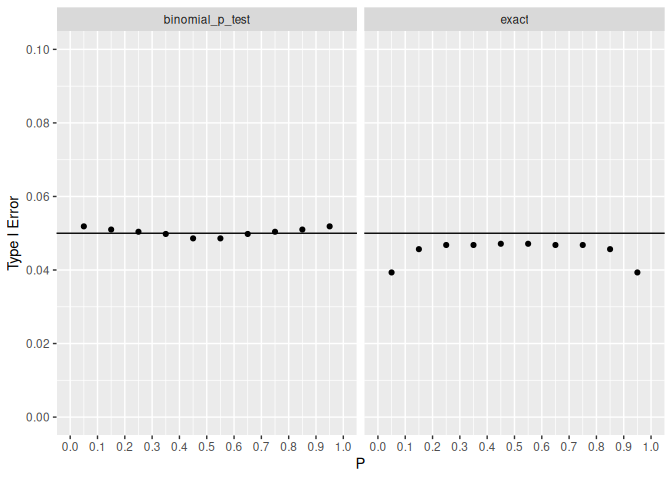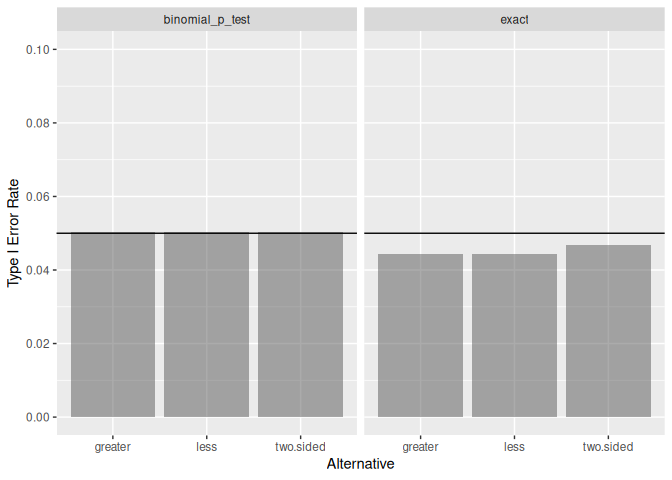

## Negative Binomial

Asymptotic theory says size needs to be large and p needs to be far from
the boundary for the chi-squared approximation to apply. This simulation
confirms the theory. When size is large, the test achieves the target 5%
type I error rate. When size is small and p is at or below .75, the test
continues to have the targeted 5% error rate.

When both requirements of asymptotic theory are not met, the type I
error rate increases. Visually this is the bottom right corner of the
right graph.

For comparison, the exact test is included. It is able to keep type I
error rate at or below the 5% over the entire parameter space because it
does not rely on an asymptotic approximation.

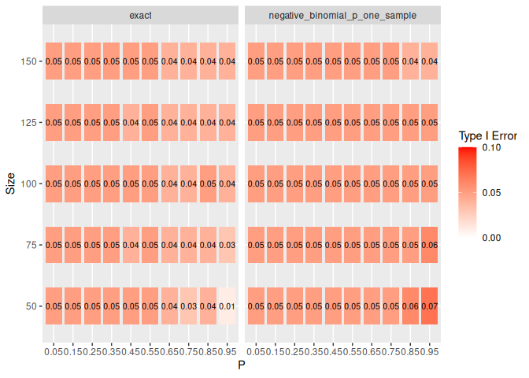

In the aggregate, the likelihood test performs similarly to other
likelihood tests across alternative hypotheses.

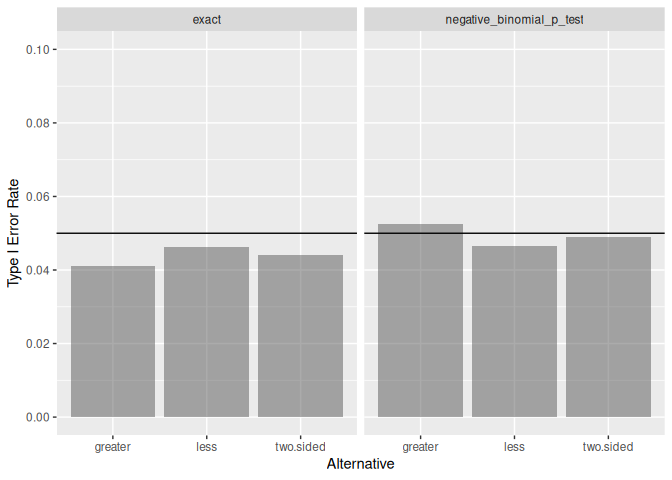

## Cauchy

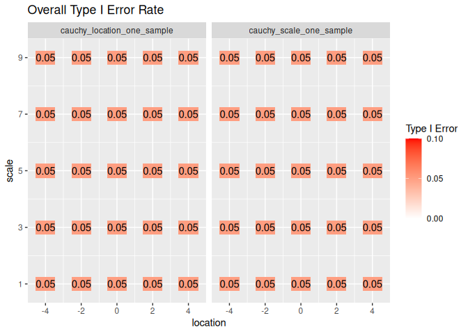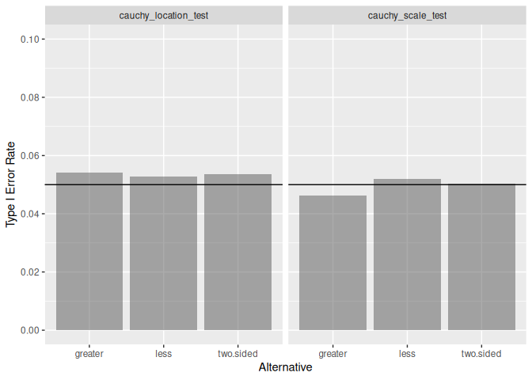

## Inverse Gaussian

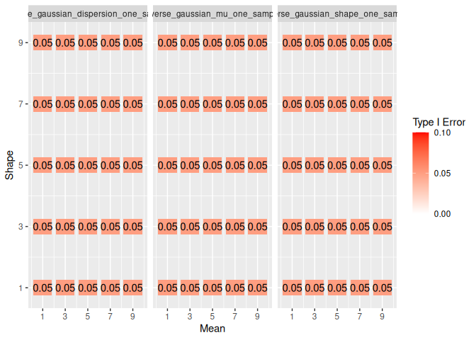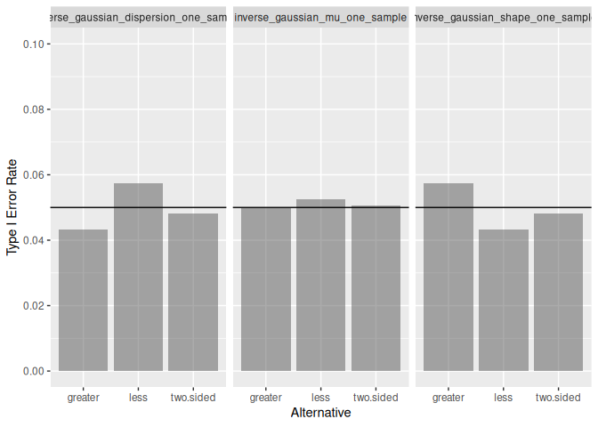

## Empirical Likelihood For Mu

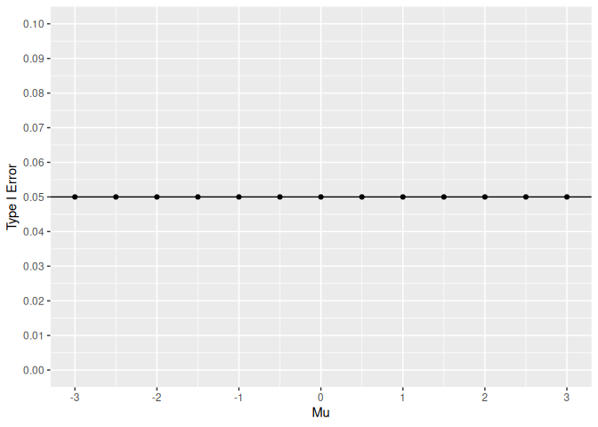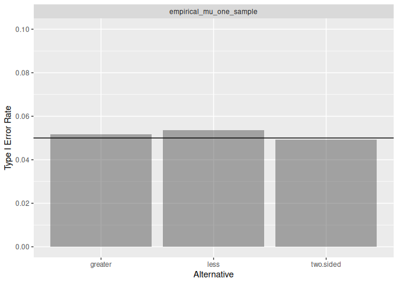

## Empirical Likelihood For Variance

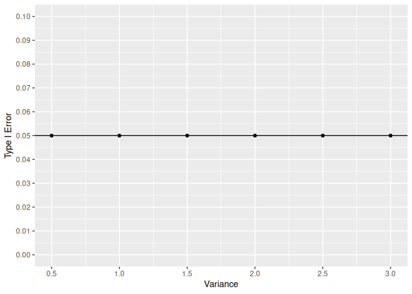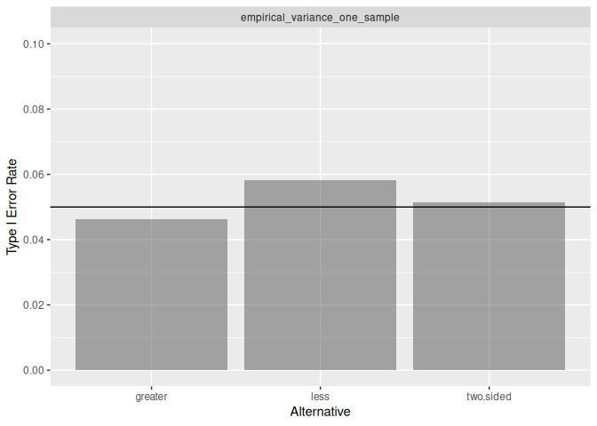

## Empirical Likelihood For Quantile

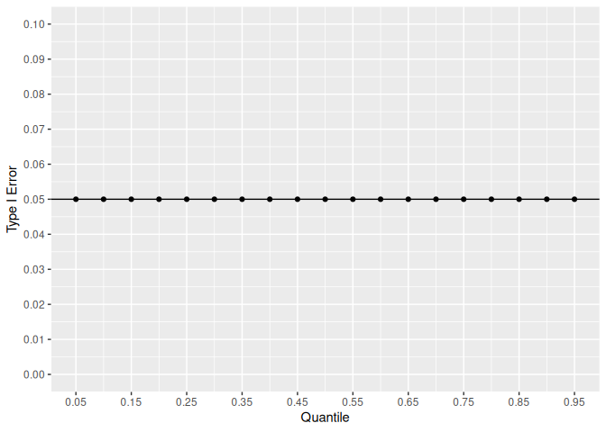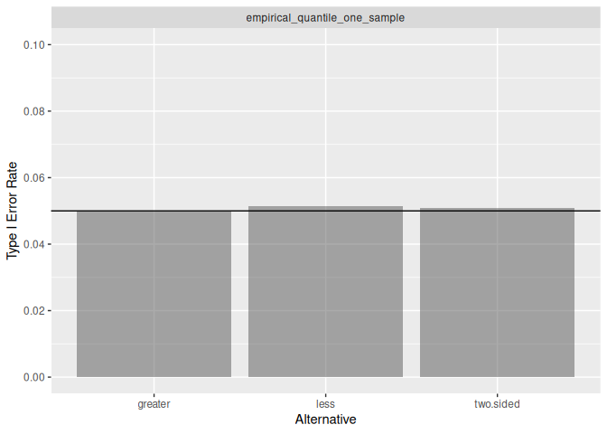
