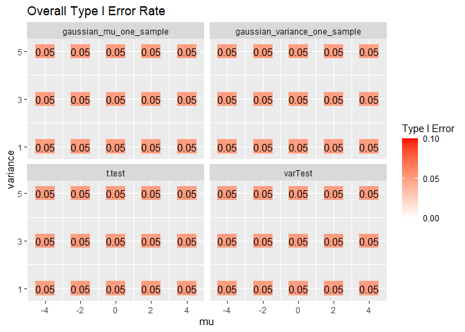
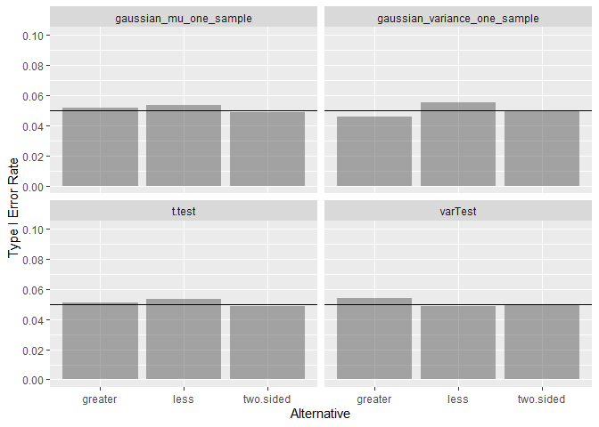
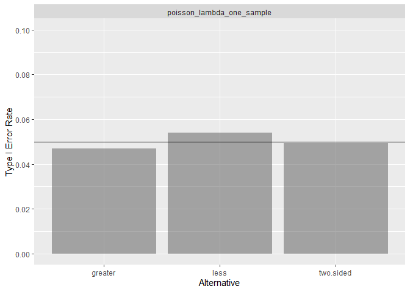
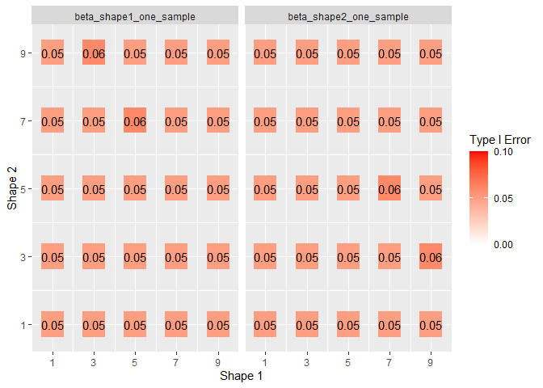
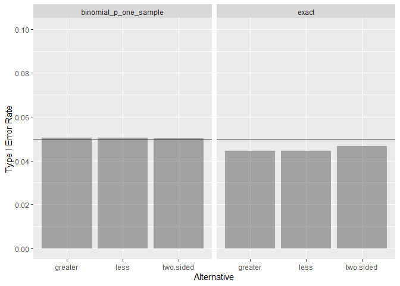
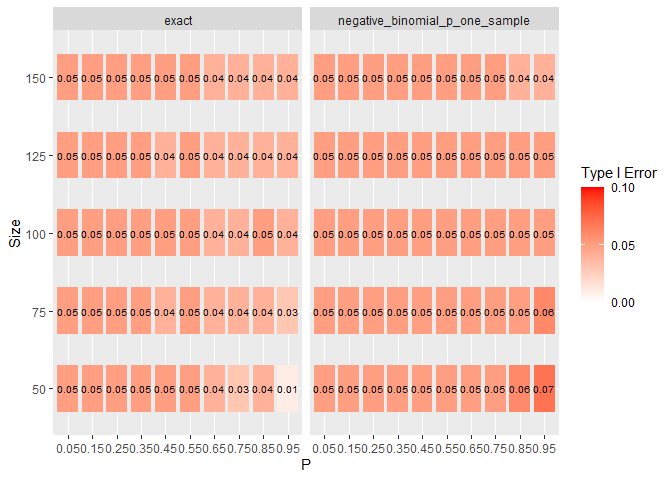
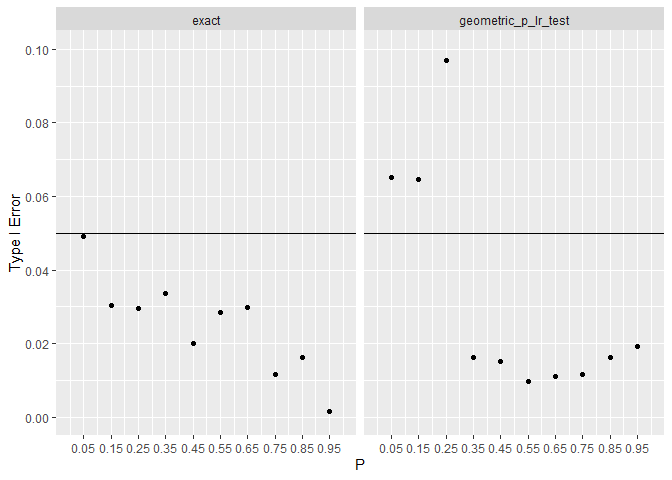

<!-- README.md is generated from README.Rmd. Please edit that file -->

## Type I Summary

Asymptotic type I error rates for LRTesteR’s likelihood ratio tests are
estimated via simulation. Calculations are based on 5,000 iterations and
a sample size of 200. Where possible, exact tests are included for
comparison.

Most tests have a type I error rate of .05. Exploring each test one by
one, many tests have a consistent type I rate across the entire
parameter space and alternative hypotheses. The negative binomial and
geometric distributions are exceptions.

# Successful Tests

For a distribution, the likelihood ratio test works well if

-   The test has an average of.05 type I error rate over the entire
    parameter space.
-   All tests achieve near .05 type I error for all alternative
    hypotheses.

To check the above, two graphs are shown per test.

## Gaussian

## Gamma

## Poisson

## Beta

## Exponential

## Binomial

# Failures

For a distribution, the likelihood ratio test is considered bad if

-   The test does not achieve near .05 type I error rate over any area
    of the parameter space.
-   The test did not achieve near .05 type I error across all
    alternative hypotheses.

## Negative Binomial

As long as the target number of success is large or p is not near one,
the type I error rate is .05. When the target number of successes is
small and p is near one, the likelihood test does not have a .05 type I
error rate. How near is too near depends on the target number of
successes. Visually this is the bottom right corner of the first graph.

In the aggregate, the likelihood test performs similarly to other
likelihood tests across alternative hypotheses.

## Geometric

In the above, type I error rates degraded as size decreased. The
geometric distribution is the same as the negative binomial with size
equal to 1. This suggests the geometric test will do poorly.

Over the entire range of p, the likelihood ratio test has type I error
rate far from the desired .05. Sometimes the likelihood test is liberal.
Sometimes it is conservative.

In the aggregate, type I error rate is below the desired .05 for two
alternatives.

