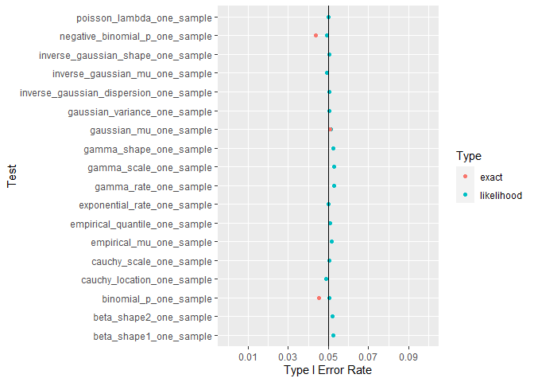
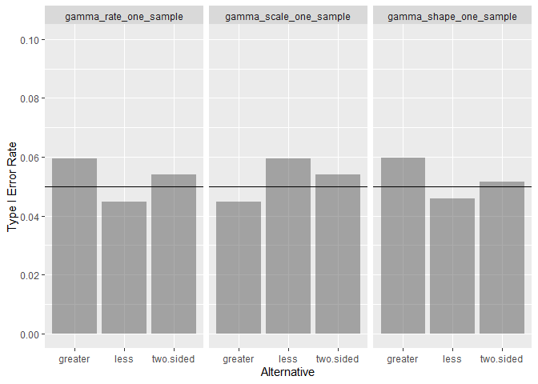
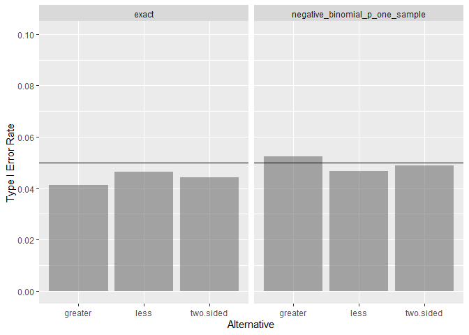
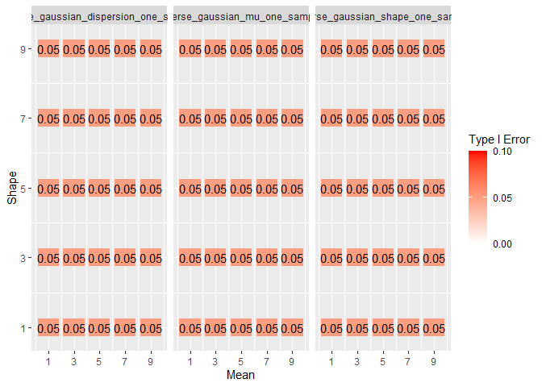
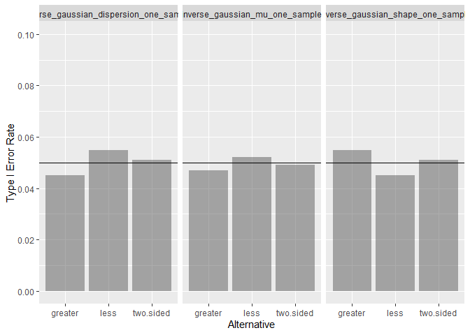
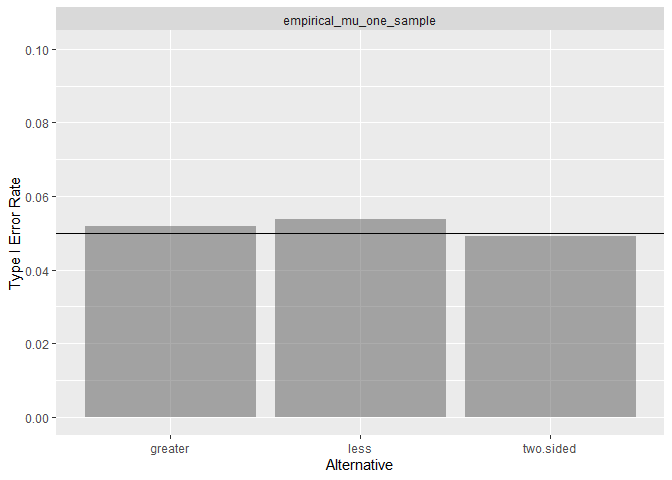

# Type I Summary

Asymptotic type I error rates for LRTesteR’s likelihood ratio tests are
estimated via simulation. Calculations are based on 2,000 iterations and
a sample size of 2,000. Where possible, exact tests are included for
comparison.

Most tests have a type I error rate of .05. Exploring each test one by
one, most tests have a consistent type I rate across the explored
parameter space and alternative hypotheses. The negative binomial has an
area where type I error rate increases slightly.

# Analysis Criteria

For a distribution, the likelihood ratio test works well if

- The test has an average of .05 type I error rate over the entire
  parameter space.
- All tests achieve near .05 type I error for all alternative
  hypotheses.

To check the above, two graphs are shown per test. For the first point,
type I error rate is calculated for many areas in the parameter
space.For the second point, results are aggregate across alternative
hypotheses.

## Gaussian

## Gamma

## Poisson

## Beta

## Exponential

## Binomial

## Negative Binomial

As long as the target number of success is large or p is not near one,
the type I error rate is .05. When the target number of successes is
small and p is near one, the likelihood test has an increase in type I
error rate. How near is too near depends on the target number of
successes. Visually this is the bottom right corner of the right graph.

In the bottom right corner, the exact test is a bit off from the target
5%. It is always conservative while the likelihood test is liberal.

In the aggregate, the likelihood test performs similarly to other
likelihood tests across alternative hypotheses.

## Cauchy

## Inverse Gaussian

## Empirical Likelihood

