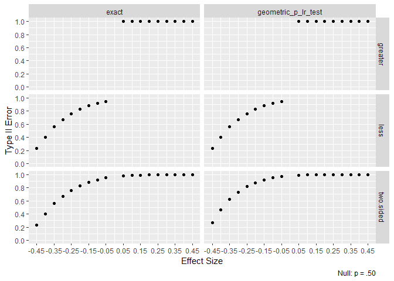

<!-- README.md is generated from README.Rmd. Please edit that file -->

## Overall Type II Error Rate

Asymptotic type II error rates for MLTesteR’s likelihood ratio tests are
estimated via simulation. Calculations are based on 5,000 iterations and
a sample size of 200. Where possible, exact tests are included for
comparison.

The overall type II error rates between the exact tests and likelihood
tests match. The geometric test stands out as having 85% type II error
on average. This test has little practical use.

# Successful Tests

For a distribution, the likelihood ratio test works well if

-   Type II error rates decrease quickly.
-   When exact tests are implemented in R, type II error rates are
    similar to the exact test.

To test the above, one graph is shown per test.

## Gaussian

## Gamma

## Poisson

## Beta

## Exponential

 ##
Binomial 

## Negative Binomial

# Failures

For a distribution, the likelihood ratio test is considered bad if

-   Type II error rate never hits zero.

## Gaussian

## Geometric

