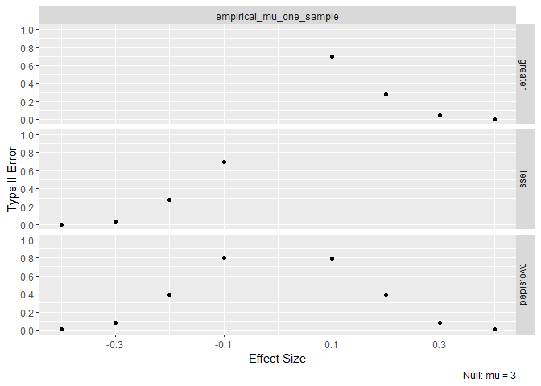

# Data Overview

Similar to type I error rates, type II error rates are estimated. The
main changes are the alternative hypothesis is true, the null hypothesis
is held constant and effect size varies. The first five data points look
like

    #> # A tibble: 240,000 × 5
    #>   test                   effectSize  stat   pvalue alt      
    #>   <chr>                       <dbl> <dbl>    <dbl> <chr>    
    #> 1 gaussian_mu_one_sample       -0.3  36.3 1.70e- 9 two.sided
    #> 2 gaussian_mu_one_sample       -0.3  26.0 3.40e- 7 two.sided
    #> 3 gaussian_mu_one_sample       -0.3  28.0 1.19e- 7 two.sided
    #> 4 gaussian_mu_one_sample       -0.3  54.7 1.39e-13 two.sided
    #> 5 gaussian_mu_one_sample       -0.3  44.1 3.04e-11 two.sided
    #> # … with 239,995 more rows
    #> # ℹ Use `print(n = ...)` to see more rows

Multiple experiments are aggregated to calculate type II error rates.

    #> # A tibble: 24 × 3
    #> # Groups:   test [2]
    #>   test                   effectSize Type_II_Error
    #>   <chr>                       <dbl>         <dbl>
    #> 1 gaussian_mu_one_sample      -0.3           0   
    #> 2 gaussian_mu_one_sample      -0.25          0   
    #> 3 gaussian_mu_one_sample      -0.2           0   
    #> 4 gaussian_mu_one_sample      -0.15          0.06
    #> 5 gaussian_mu_one_sample      -0.1           0.34
    #> # … with 19 more rows
    #> # ℹ Use `print(n = ...)` to see more rows

Like type I calculations, each simulated experiment is based on a sample
size of 500. Each combination of effect size and test are repeated 5,000
times. Where possible, exact tests are included for comparison.

# Overall Type II Error Rate

All tests achieve near 0% type II error for a large enough effect size.

# Analysis Criteria

For a distribution, the likelihood ratio test works well if both of the
following are true.

- Type II error rates are near zero for large effect sizes.
- When exact tests are implemented in R, type II error rates are similar
  to the exact test.

To check the above, one graph is shown per test. When the effect size is
near 0, type II error rates are near 100%. As effect size grows, type II
error rates decrease. All tests achieve near 0% type II for large enough
effect sizes.

## Gaussian

## Gamma

## Poisson

## Beta

## Exponential

## Binomial

## Negative Binomial

## Cauchy

## Inverse Gaussian

## Empirical Likelihood

