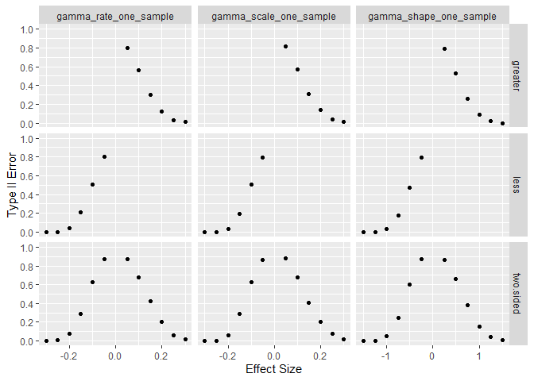

<!-- README.md is generated from README.Rmd. Please edit that file -->

# Overall Type II Error Rate

Asymptotic type II error rates for LRTesteR’s likelihood ratio tests are
estimated via simulation. Calculations are based on 2,000 iterations and
a sample size of 200. Simulation holds the null hypothesis constant
across all alternatives and effect sizes. Where possible, exact tests
are included for comparison.

All tests can achieve near 0% type II error for a large enough effect
size.

# Analysis Goals

For a distribution, the likelihood ratio test works well if

-   Type II error rates decrease quickly.
-   When exact tests are implemented in R, type II error rates are
    similar to the exact test.

To check the above, one graph is shown per test.

## Gaussian

## Gamma

## Poisson

## Beta

## Exponential

## Binomial

## Negative Binomial

## Cauchy

