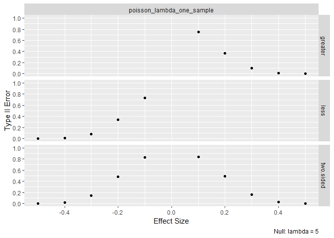
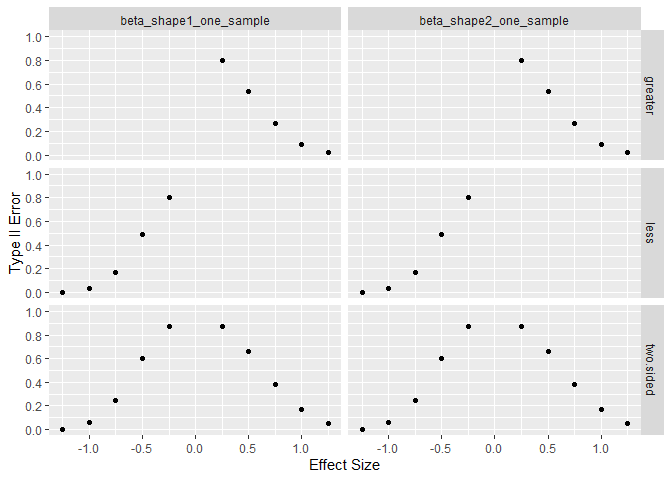

<!-- README.md is generated from README.Rmd. Please edit that file -->

## Overall Type II Error Rate

Asymptotic type II error rates for LRTesteR’s likelihood ratio tests are
estimated via simulation. Calculations are based on 5,000 iterations and
a sample size of 200. Simulation holds the null hypothesis constant
across all alternatives and effect sizes. Where possible, exact tests
are included for comparison.

Most tests can achieve near 0% type II error for a large enough effect
size. The test for a geometric distribution’s p stands out as not
getting close to zero. Nearly the entire range of effect size was tested
for the geometric test, and it did not get close to zero.

# Successful Tests

For a distribution, the likelihood ratio test works well if

-   Type II error rates decrease quickly.
-   When exact tests are implemented in R, type II error rates are
    similar to the exact test.

To check the above, one graph is shown per test.

## Gaussian

## Gamma

## Poisson

## Beta

## Exponential

## Binomial

## Negative Binomial

# Failures

For a distribution, the likelihood ratio test is considered bad if

-   Type II error rate never hits zero.

## Geometric

For the greater than and two sided alternatives, this test has 100% type
II error when the null is .50. It will never reject the null regardless
of the data. For all alternatives it never does better than .20%. This
test unusable.

It is interesting to note the likelihood test approximation worked very
well. The test it is approximating is unusable.

